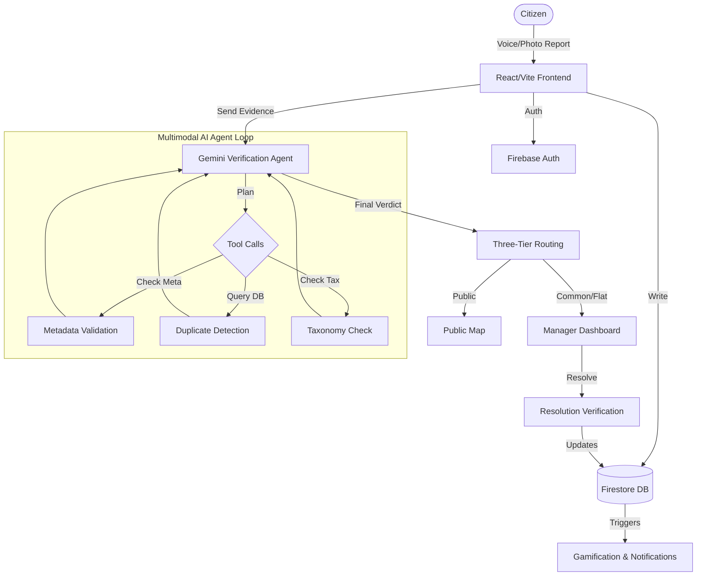
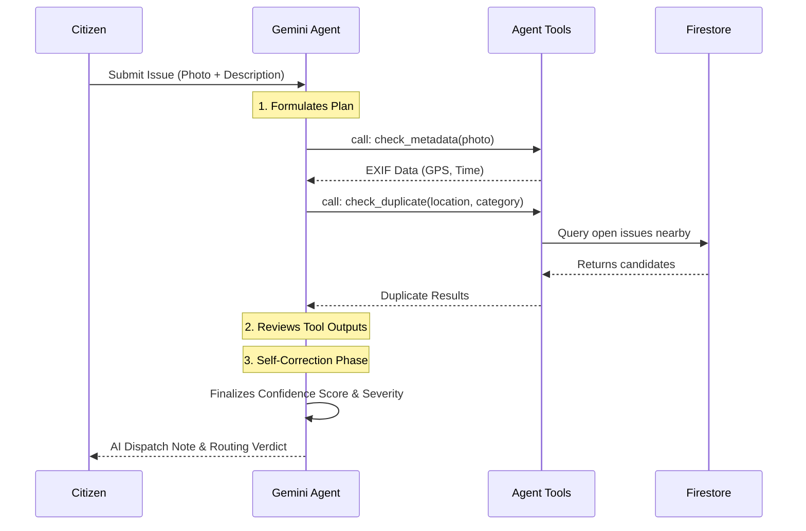

# 🌟 Nivaran

> **Hyperlocal Civic & Building Issue Resolver**

Nivaran is a comprehensive, AI-powered hyperlocal civic routing and resolution platform tailored for communities and residential buildings. It acts as an intelligent, real-time civic desk that bridges the gap between citizens, building managers, and municipal bodies by streamlining the reporting, verification, and tracking of civic issues.

---

## 📖 Project Overview

### The Problem
Citizens often struggle to report local issues (like broken streetlights or potholes) due to fragmented municipal systems, language barriers, and a lack of transparency. Building managers are overwhelmed with unverified complaints via chat groups, lacking a structured way to triage and prioritize hazards.

### Why Current Solutions are Insufficient
Existing 311 systems or complaint portals are often static forms that don't accommodate non-English speakers, fail to filter out spam or duplicates, and provide zero feedback to the citizen once a report is submitted, leading to apathy.

### How Nivaran Solves It
By leveraging the advanced multimodal capabilities of the **Gemini 2.5 Flash** model, Nivaran removes language and accessibility barriers through seamless native-language voice reporting and automated translation. The AI acts as an autonomous triage agent—instantly categorizing reports, assessing severity, and performing a multi-step reasoning loop to verify photographic evidence, check for duplicates, and route the issue to the correct authority. Furthermore, it gamifies civic engagement to reward citizens for improving their community.

---

## ✨ Key Features

### 🤖 AI Verification
* **Multi-Step Reasoning Loop**: Gemini operates as an agent, formulating a plan, calling tools (duplicate checks, metadata validation), and revising its verdict before generating a confidence score.
* **Computer Vision Validation**: Gemini automatically verifies uploaded media to flag potential false reports, duplicate submissions, or unrelated images.
* **AI Dispatch Notes**: Transparent reasoning traces are surfaced in the UI so both citizens and managers understand *why* the AI made its routing decision.

### 🎙️ Issue Reporting
* **Native Language Voice Input**: Citizens can record voice notes directly in their preferred language (e.g., Hindi, Marathi, Bengali).
* **Multimodal Translation Pipeline**: The raw audio is processed by `gemini-2.5-flash` to transcribe, translate to English, and auto-categorize the issue.
* **Evidence Upload**: Submit photos, videos, or audio to back up your report.

### 🔀 Three-Tier Routing
* **Flat/Personal**: Issues within a resident's private space (routed to maintenance).
* **Common Area**: Issues in shared building spaces (routed to building manager).
* **Public/Street**: Civic issues outside the building (routed to municipal dashboards/public map).

### 🛠️ Community Verification & Resolution Workflow
* **Community Fix Initiative**: Citizens can organize to resolve safe public issues collaboratively.
* **"After" Evidence Verification**: Upload an "After" photo/video. Gemini compares it against the original report to verify the fix.
* **Celebratory Broadcasts**: Real-time broadcast toasts are pushed to online citizens when a local issue is resolved.

### 📊 Manager Dashboard
* **Automated Triage**: Managers see a prioritized queue of issues sorted by AI-assigned severity.
* **Time-Decay Agents**: AI automatically checks open issues over time to re-notify or escalate based on citizen recurrence reports.

### 🏆 Gamification
* **XP & Milestones**: Earn points for reporting valid issues, confirming others' reports, or resolving community problems.
* **Coupon Rewards**: Cross point thresholds to unlock mock local rewards (e.g., free chai, grocery discounts).

### 🗺️ Maps & Notifications
* **Live Spatial Tracker**: Browse anonymous public street complaints on a real-time interactive map.
* **Proximity Alerts**: Push notifications ask *"Is this still a problem?"* when citizens walk near active public issues (simulated).

---

## 🛠️ Google Technologies Used

| Technology | Purpose |
|------------|---------|
| **Gemini 2.5 Flash** | Powers the core AI Verification Agent, multimodal translation, issue categorization, and the time-decay follow-up agent via `@google/genai`. |
| **Google Cloud Firestore** | Provides real-time NoSQL database synchronization across all active citizen and manager dashboards. |
| **Firebase Authentication** | Manages secure sign-ins, handling Google Identity platform and standard credential accounts. |
| **Google Workspace (NodeMailer)** | Handles SMTP email dispatch for time-decay escalations and notifications. |

---

## 📐 System Architecture



---

## 🧠 AI Workflow

The report verification pipeline is a true multi-step agentic loop, rather than a single structured call. 



---

## 🚀 Judge's Guide (3–5 Minute Demo)

Follow this quick walkthrough to experience the complete capabilities of Nivaran:

1. **Sign In:**
   - Open the deployed application.
   - Click **Demo Accounts (Test Mode)** and select **Russel Gandhi (Citizen)**.
2. **Citizen Dashboard & Reporting:**
   - Click **Report New Issue**.
   - **Tier Selection:** Choose *Common Area* or *Public*.
   - **Upload Evidence:** Select a photo of a common civic issue (e.g., a pothole or broken pipe).
   - **Description:** Type a short description or use the *Voice* tab to speak in Hindi/Marathi.
3. **Observe AI Agentic Loop:**
   - Submit the report. You will see the AI actively reasoning, generating a plan, executing tool calls (checking duplicates/metadata), and arriving at a verdict.
   - Read the **AI Dispatch Note** attached to your generated ticket.
4. **Gamification & Map:**
   - Check the **Leaderboard/Rewards** tab to see your XP increase.
   - Navigate to the **Map View** to see your issue plotted (if Public).
5. **Manager Resolution:**
   - Click the profile icon (top right) and sign out.
   - Click Demo Accounts and sign in as **Vikram Sharma (Manager)**.
   - Open the Manager Dashboard, find the issue you just created, and click **Resolve**.
   - Upload an "After" photo to trigger the Gemini resolution verifier, closing the loop.

---

## 🔐 Demo Credentials

Nivaran features built-in instant demo authentication to speed up testing. 

On the login screen, look for the **Demo Accounts (Test Mode)** section:
- **Citizen Demo:** `Russel Gandhi` (Click to instantly sign in)
- **Manager Demo:** `Vikram Sharma` (Click to instantly sign in)

If you prefer to test standard authentication, you can also use "Sign in with Google."

---

## 💻 Installation

### Prerequisites
- Node.js (v18+)
- Firebase Project Setup (Firestore, Auth)
- Gemini API Key

### Setup Instructions

1. **Clone the repository:**
   ```bash
   git clone https://github.com/your-username/nivaran.git
   cd nivaran
   ```

2. **Install dependencies:**
   ```bash
   npm install
   ```

3. **Configure Environment Variables:**
   Create a `.env` file in the root directory (see section below).

4. **Start the Development Server:**
   ```bash
   npm run dev
   ```
   The application will start at `http://localhost:3000`.

---

## 🔑 Environment Variables

Create a `.env` file in the root directory with the following variables:

```env
# Required: Google Gemini API Key for the multi-step verification agent
GEMINI_API_KEY=your_gemini_api_key_here
```

*Note: Firebase configuration is handled via the `firebase-applet-config.json` file in the root directory.*

---

## 📁 Project Structure

```text
nivaran/
├── src/
│   ├── components/       # React components (Wizards, Dashboards, Maps)
│   ├── lib/              # Firebase initialization and helpers
│   ├── App.tsx           # Main application router and auth state
│   ├── main.tsx          # React entry point
│   └── types.ts          # Global TypeScript interfaces
├── server.ts             # Express backend, Gemini Agent loop, and Vite middleware
├── package.json          # Dependencies and scripts (dev, build, start)
└── firebase-applet-config.json # Firebase project configuration
```
- **`server.ts`**: Contains the complex Gemini agentic loops, time-decay agents, and API routes, running in a full-stack Express environment alongside Vite.
- **`src/components/ReportIssueWizard.tsx`**: The core multi-step reporting UI that handles multimodal uploads and displays the AI reasoning trace.

---

## 🗺️ Future Roadmap

- [x] **Advanced Agentic Loop**: Multistep reasoning for evidence validation.
- [ ] **WhatsApp Bot Integration**: Allow citizens to send a photo and voice note directly to a WhatsApp number to trigger the Gemini reporting pipeline.
- [ ] **Hardware IoT Integration**: Smart trash cans and environmental sensors that automatically generate Level 1 alerts on the Manager Dashboard.
- [ ] **Municipal Escalation API**: Direct API integration with local government 311 systems for unhandled public issues.

---

## 📄 License

This project is licensed under the MIT License.
